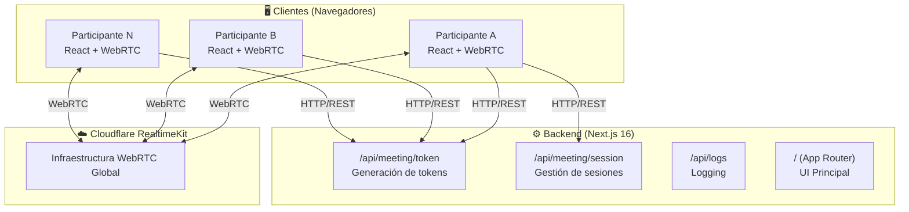
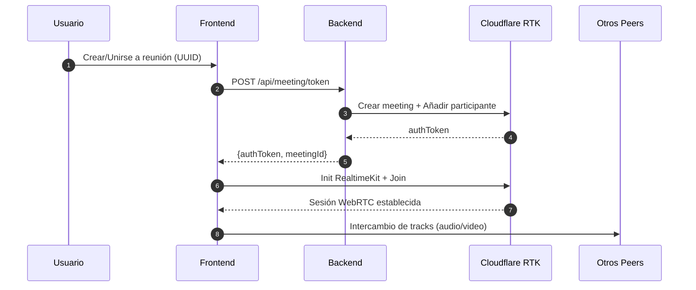
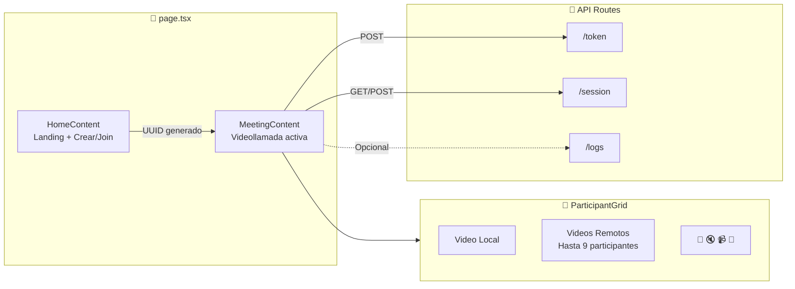

# OpenMeet

[](https://nextjs.org/)
[](https://react.dev/)
[](https://www.typescriptlang.org/)
[](https://tailwindcss.com/)
[](https://developers.cloudflare.com/realtime/)

> **Videollamadas en el navegador, sin complicaciones.**

OpenMeet es una aplicación web de videoconferencias construida sobre la infraestructura global de Cloudflare. Sin instalaciones, sin plugins — solo abre el enlace y conecta.

[Demo en vivo](#) · [Reportar Bug](../../issues) · [Solicitar Feature](../../issues)

---

## ✨ Features

| Feature | Descripción |
|---------|-------------|
| 🎥 **Video en tiempo real** | WebRTC optimizado vía Cloudflare RealtimeKit |
| 🔊 **Audio bidireccional** | Mute/unmute con un clic |
| 👥 **Múltiples participantes** | Grid layout adaptativo hasta 9+ usuarios |
| 🔗 **Links instantáneos** | Comparte la reunión con copiar/pegar |
| 🆔 **IDs persistentes** | Las salas usan UUIDs estándar |
| 📱 **Responsive** | Funciona en desktop, tablet y móvil |
| ⚡ **Sin backend pesado** | API routes serverless de Next.js |

---

## 🏗️ Arquitectura



### Flujo de Conexión



### Arquitectura de Componentes



---

## 🛠️ Tech Stack

| Capa | Tecnología |
|------|------------|
| **Framework** | [Next.js 16](https://nextjs.org/) con App Router |
| **Frontend** | [React 19](https://react.dev/) + TypeScript |
| **Estilos** | [Tailwind CSS v4](https://tailwindcss.com/) |
| **Video/RTC** | [Cloudflare RealtimeKit](https://developers.cloudflare.com/realtime/) |
| **Build** | [PostCSS](https://postcss.org/) |
| **Linting** | [ESLint 9](https://eslint.org/) |

---

## 📁 Estructura del Proyecto

```
.
├── src/
│   ├── app/                          # App Router de Next.js
│   │   ├── api/                      # API Routes
│   │   │   ├── logs/route.ts         # Endpoint de logging
│   │   │   └── meeting/
│   │   │       ├── session/route.ts  # Gestión de sesiones
│   │   │       └── token/route.ts    # Generación de tokens
│   │   ├── layout.tsx                # Root layout
│   │   └── page.tsx                  # Home + UI de reunión
│   └── components/
│       └── Meeting.tsx               # Componente de video (legacy)
├── public/                           # Assets estáticos
├── .env.local                        # Variables de entorno
├── next.config.ts                    # Config de Next.js
└── package.json
```

---

## 🚀 Getting Started

### Prerrequisitos

- Node.js 20+
- npm 10+
- Cuenta de Cloudflare con RealtimeKit habilitado

### Instalación

```bash
# 1. Clonar el repositorio
git clone https://github.com/jonattan-infante/OpenMeet.git
cd OpenMeet

# 2. Instalar dependencias
npm install

# 3. Configurar variables de entorno
cp env.example .env.local
# Editar .env.local con tus credenciales reales de Cloudflare

# 4. Iniciar servidor de desarrollo
npm run dev
```

Abre [http://localhost:3000](http://localhost:3000) en tu navegador.

---

## 🔐 Environment Variables

Crea un archivo `.env.local` con las siguientes variables:

```bash
# Cloudflare RealtimeKit
CLOUDFLARE_ACCOUNT_ID=your_account_id_here
CLOUDFLARE_APP_ID=your_app_id_here
CLOUDFLARE_API_TOKEN=your_api_token_here

# Opcional: para el componente legacy Meeting.tsx
NEXT_PUBLIC_CLOUDFLARE_APP_ID=your_app_id_here
NEXT_PUBLIC_CLOUDFLARE_APP_SECRET=your_app_secret_here
```

**¿Dónde conseguir estas credenciales?**
1. Ve a [Cloudflare Dashboard](https://dash.cloudflare.com)
2. Navega a **Realtime** → **Kit**
3. Crea una nueva aplicación o usa una existente
4. Copia el Account ID, App ID y genera un API Token

---

## 🔌 API Endpoints

| Método | Endpoint | Descripción |
|--------|----------|-------------|
| `POST` | `/api/meeting/token` | Obtiene token de autenticación para unirse a reunión |
| `POST` | `/api/meeting/session` | Guarda el mapping meetingId → sessionId |
| `GET` | `/api/meeting/session?meetingId=xxx` | Recupera sessionId por meetingId |
| `POST` | `/api/logs` | Logging server-side para debugging |

### Ejemplo: Crear unirse a reunión

```bash
# Obtener token para una reunión
curl -X POST http://localhost:3000/api/meeting/token \
  -H "Content-Type: application/json" \
  -d '{"meetingId": "550e8400-e29b-41d4-a716-446655440000"}'

# Respuesta:
# {
#   "authToken": "eyJhbGciOiJIUzI1NiIs...",
#   "meetingId": "550e8400-e29b-41d4-a716-446655440000"
# }
```

---

## 🎯 Uso

### Crear una nueva reunión

1. Abre la aplicación en el navegador
2. Haz clic en **"New Meeting"**
3. Comparte el link generado con otros participantes

### Unirse a una reunión existente

1. Recibe el link de invitación (ej: `https://openmeet.app/?id=uuid-aqui`)
2. Abre el link — se unirá automáticamente
3. O introduce el ID manualmente en el campo "Join an existing meeting"

### Controles durante la llamada

| Control | Acción |
|---------|--------|
| 🎤 / 🔇 | Mute/unmute micrófono |
| 📹 / 📷 | Encender/apagar cámara |
| **Copy Link** | Copiar link de invitación al portapapeles |
| **Leave** | Salir de la reunión |

---

## 🚢 Deployment

### Vercel (Recomendado)

```bash
# Instalar Vercel CLI
npm i -g vercel

# Deploy
vercel --prod
```

Configura las variables de entorno en el dashboard de Vercel.

### Docker

```bash
# Build
docker build -t openmeet .

# Run
docker run -p 3000:3000 --env-file .env.local openmeet
```

### Cloudflare Pages

1. Conecta tu repo en [Cloudflare Pages](https://pages.cloudflare.com/)
2. Configura el build command: `npm run build`
3. Añade las variables de entorno necesarias
4. Deploy

---

## 🐛 Troubleshooting

| Problema | Solución |
|----------|----------|
| "Missing credentials" | Verifica que todas las variables de entorno estén configuradas |
| "Failed to get auth token" | Revisa que el `CLOUDFLARE_API_TOKEN` tenga permisos para RealtimeKit |
| No se ve el video remoto | Verifica que el meetingId sea un UUID válido |
| Error de CORS | Asegúrate de que el dominio esté permitido en Cloudflare |

---

## 📝 Roadmap

- [ ] Soporte para chat de texto
- [ ] Compartir pantalla
- [ ] Grabación de reuniones
- [ ] Salas con contraseña
- [ ] Lista de participantes
- [ ] Reacciones/emojs
- [ ] Modo "solo audio"

---

## 📄 Licencia

MIT License — ver [LICENSE](./LICENSE) para más detalles.

---

## 🙏 Créditos

- **Cloudflare** por [RealtimeKit](https://developers.cloudflare.com/realtime/)
- **Vercel** por [Next.js](https://nextjs.org/)
- **Tailwind Labs** por [Tailwind CSS](https://tailwindcss.com/)

---

<p align="center">
  Hecho con ❤️ usando infraestructura de <strong>Cloudflare</strong>
</p>
